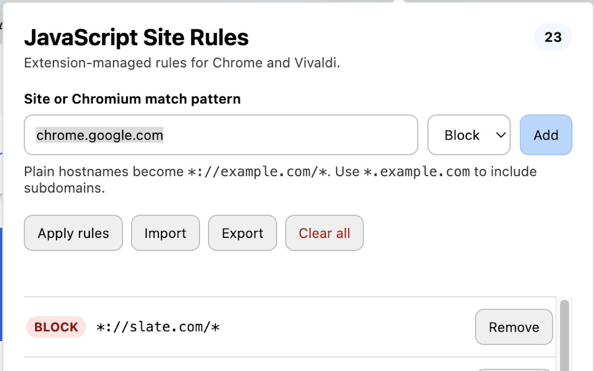

# JavaScript Site Rules

This is an extension for Chromium based browsers that allows or blocks JavaScript from running on a site.
The list of sites and capabilities is synced among the browsers, but can also be exported/imported through the extention.

## Adding sites

Sites may be added at anytime by clicking on the toolbar icon.
If you are on a site that isn't in the list, the hostname will prepopulate the form field.

## Usage

Anytime you are on a site that has JavaScript blocked, the toolbar icon will have a red JS badge.
